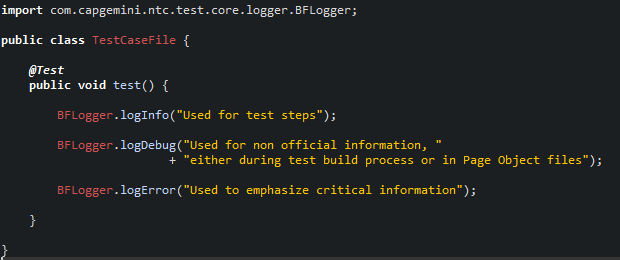
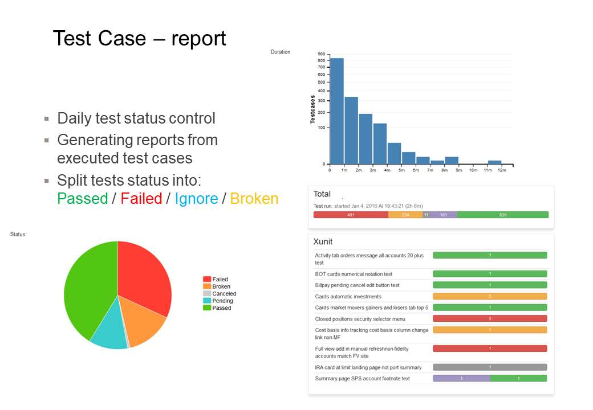
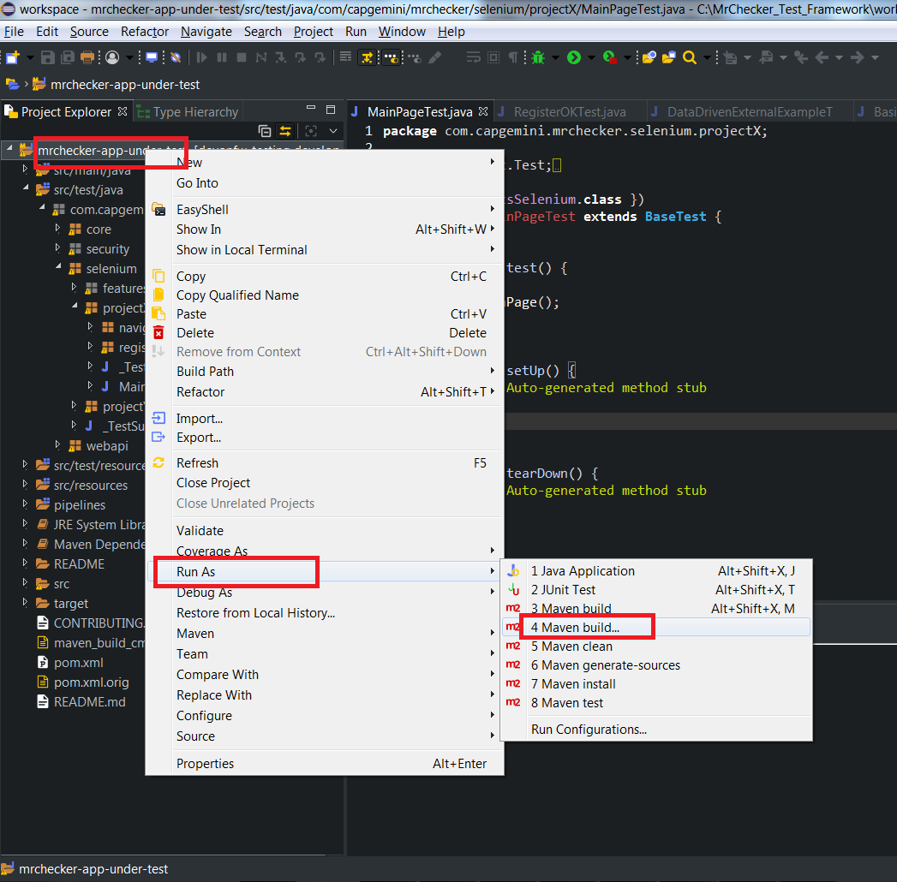
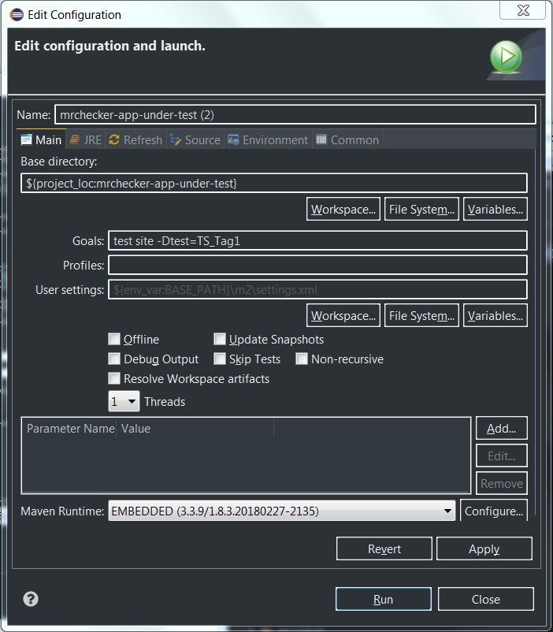
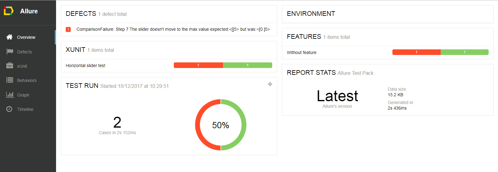
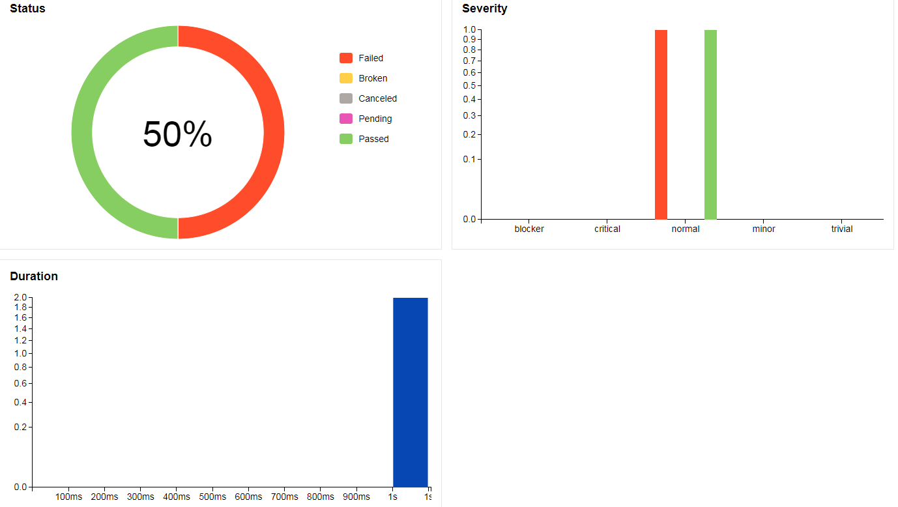

Content:
* [Allure Logger  - > BFLogger](https://github.com/devonfw/devonfw-testing/wiki/Allure-report#allure-logger-----bflogger)
    * [Where to find saved logs](https://github.com/devonfw/devonfw-testing/wiki/Allure-report#where-to-find-saved-logs)
    * [How to use logger](https://github.com/devonfw/devonfw-testing/wiki/Allure-report#how-to-use-logger)
    * [Type of loggers](https://github.com/devonfw/devonfw-testing/wiki/Allure-report#type-of-loggers)
* [Allure Reports](https://github.com/devonfw/devonfw-testing/wiki/Allure-report#allure-reports) 
    * [Generate report - command line](https://github.com/devonfw/devonfw-testing/wiki/Allure-report#generate-report---command-line)
    * [Generate report - Eclipse](https://github.com/devonfw/devonfw-testing/wiki/Allure-report#generate-report---eclipse)
    * [Generate report - Jenkins](https://github.com/devonfw/devonfw-testing/wiki/Allure-report#generate-report---jenkins)
    * [Allure dashboard](https://github.com/devonfw/devonfw-testing/wiki/Allure-report#allure-dashboard)
    * [Defects](https://github.com/devonfw/devonfw-testing/wiki/Allure-report#defects)
    * [Graph](https://github.com/devonfw/devonfw-testing/wiki/Allure-report#graph)
***

# Allure Logger  - > BFLogger 

In Allure E2E Test Framework you have ability to use and log any additional information crucial either for: 
* test steps
* test exection
* page object actions , and many more. 

## Where to find saved logs
Every logged information is saved in separate test file, as a result of use parallel tests execution.

Place where they are saved: 
1. In test folder _C:\Allure_Test_Framework\allure-app-under-test\logs_
1. In every [Allure Test report](https://github.com/devonfw/devonfw-testing/wiki/Allure-report#allure-reports), logs are always embedded as a attachment, according to test run.

## How to use logger: 
* Start typing 
> BFLogger
* Then type **.** (dot)

## Type of loggers:
* *BFLogger.logInfo("Your text")*  - used for test steps
* *BFLogger.logDebug("Your text")*  - used for non official information, either during test build process or in Page Object files
* *BFLogger.logError("Your text")* - used to emphasize critical information

Console output:

***

# Allure Reports

Allure is a tool designed for test reports. 

### Generate report - command line

You can generate a report using one of the following command:

> mvn test allure:serve -Dtest=TS_Tag1

Report will be generated into temp folder. Web server with results will start. You can additionally configure the server timeout. The default value is "3600" (one hour).

System property allure.serve.timeout.

> mvn test allure:report -Dtest=TS_Tag1

Report will be generated tо directory: target/site/allure-maven/index.html

**NOTE:** Please open *index.html* file under Firefox. Chrome has some limitation to present dynamic content

### Generate report - Eclipse

Report is created here *allure-app-under-test\target\site\allure-report\index.html*

**NOTE:** Please open *index.html* file under Firefox. Chrome has some limitation to present dynamic content

### Generate report - Jenkins

In our case, we'll use the Allure Jenkins plugin. When integrating Allure in the Jenkins job configuration, we'll have direct access to the build's test report.

There are several ways to access the Allure Test Reports:

* Using the "Allure Report" button on the left navigation bar or center of the general job overview
* Using the "Allure Report" button on the left navigation bar or center of a specific build overview

Afterwards you'll be greeted with either the general Allure Dashboard (showing the newest build) or the Allure Dashboard for a specific (older) build.

## Allure dashboard

The Dashboard provides a graphical overview on how many test cases were successful, failed or are broken.

* **Passed** means, that the test case was executed successfully.
* **Broken** means, that there were mistakes inside of the test method or test class. As tests are being treated as code, broken code has to be expected, resulting in occasionally _broken_ test results.
* **Failed** means that an assertion failed.

## Defects

The defects tab lists out all the defects that occurred, including a description. Clicking on a list item displays the test case which resulted in an error. Again, clicking on the test case allows the user to have a look at the test case steps, as well as Log files or Screenshots of the failure.

## Graph

The graph page includes a pie chart of all tests, showing their result status (failed, passed, etc.). Another graph allows insight into the time elapsed during the tests. This is a very useful information to find and eliminate possible bottlenecks in test implementations.

