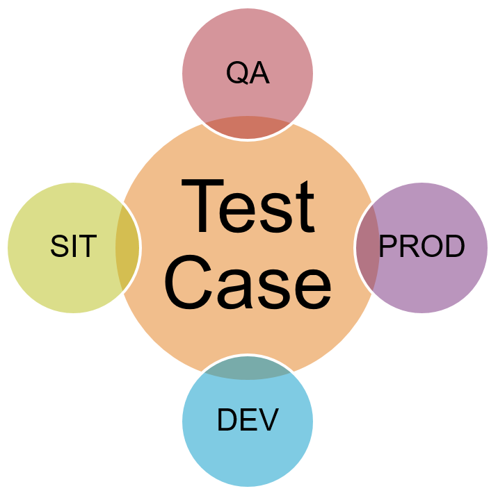
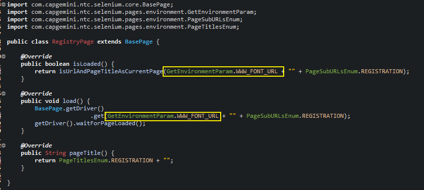
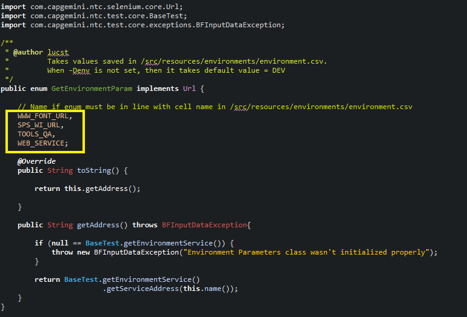
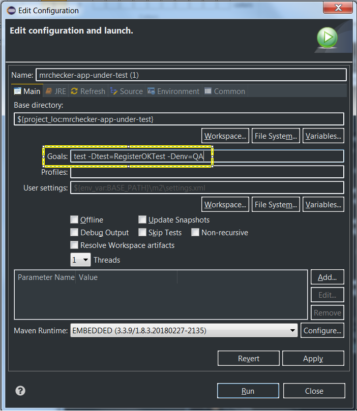

Content:
* [System under test environments](https://github.com/devonfw/devonfw-testing/wiki/Different-environments#system-under-test-environments)
* [How to use system environment](https://github.com/devonfw/devonfw-testing/wiki/Different-environments#how-to-use-system-environment)
* [How to create / update system environment](https://github.com/devonfw/devonfw-testing/wiki/Different-environments#how-to-create--update-system-environment)
    * [External file with variable values](https://github.com/devonfw/devonfw-testing/wiki/Different-environments#external-file-with-variable-values)
    * [Encrypting sensitive data](https://github.com/devonfw/devonfw-testing/wiki/Different-environments#encrypting-sensitive-data)
    * [Bridge between external file nad Page class](https://github.com/devonfw/devonfw-testing/wiki/Different-environments#bridge-between-external-file-nad-page-class)
* [Run test case with system environment](https://github.com/devonfw/devonfw-testing/wiki/Different-environments#run-test-case-with-system-environment)
    * [Command Line](https://github.com/devonfw/devonfw-testing/wiki/Different-environments#command-line)
    * [Eclipse](https://github.com/devonfw/devonfw-testing/wiki/Different-environments#eclipse)


***


# System under test environments



* *Quality assurance* or *QA* is a way of preventing mistakes or defects in manufactured products and avoiding problems when delivering solutions or services to customers; which ISO 9000 defines as "part of quality management focused on providing confidence that quality requirements will be fulfilled".

* *System integration testing* or *SIT* is a high-level software testing process in which testers verify that all related systems maintain data integrity and can operate in coordination with other systems in the same environment. The testing process ensures that all sub-components are integrated successfully to provide expected results.

* *Development* or *Dev* testing is performed by the software developer or engineer during the construction phase of the software development life-cycle. Rather than replace traditional QA focuses, it augments it. Development testing aims to eliminate construction errors before code is promoted to QA; this strategy is intended to increase the quality of the resulting software as well as the efficiency of the overall development and QA process. 

* *Prod* If the customer accepts the product, it is deployed to a *production* environment, making it available to all users of the system.


# How to use system environment

In Page classes, when you load / start web, it is uncommon to save fixed main url.  

Value flexibility is a must, when your web application under test, have different main url, dependence on environmnent (DEV, QA, SIT, ..., PROD) 

Instead of *hard coded* main url variable, you build your Page classe with dynamic variable. 

Example of dynamic variable *GetEnvironmentParam.WWW_FONT_URL*


# How to create / update system environment

## External file with variable values 

Dynamic variable values are stored under path *mrchecker-app-under-test\src\resources\enviroments\environments.csv*. 

**NOTE:** As environments.csv is Comma-separated file, please be aware of any edition and then save it under Excel. 


## Encrypting sensitive data

Some types of data you might want to store as environment settings are sensitive in nature (e.g. passwords). You might not want to store them (at least not in their plaintext form) in your repository. To be able to encrypt sensitive data you need to do following:

1. Create a secret (long, random chain of characters) and store it under *mrchecker-app-under-test\src\resources\secretData.txt*. Example: `LhwbTm9V3FUbBO5Tt5PiTUEQrXGgWrDLCMthnzLKNy1zA5FVTFiTdHRQAyPRIGXmsAjPUPlJSoSLeSBM`
2. Exclude the file from being checked into the git repository by adding it to *git.ignore*. You will need to pass the file over a different channel among your teammates.
3. Encrypt the values before putting them into the *environments.csv* file by creating following script (put the script where your jasypt library resides, e.g. *C:\MrChecker_Test_Framework\m2\repository\org\jasypt\jasypt\1.9.2*):

```
@ECHO OFF

set SCRIPT_NAME=encrypt.bat
set EXECUTABLE_CLASS=org.jasypt.intf.cli.JasyptPBEStringEncryptionCLI
set EXEC_CLASSPATH=jasypt-1.9.2.jar
if "%JASYPT_CLASSPATH%" == "" goto computeclasspath
set EXEC_CLASSPATH=%EXEC_CLASSPATH%;%JASYPT_CLASSPATH%

:computeclasspath
IF "%OS%" == "Windows_NT" setlocal ENABLEDELAYEDEXPANSION
FOR %%c in (%~dp0..\lib\*.jar) DO set EXEC_CLASSPATH=!EXEC_CLASSPATH!;%%c
IF "%OS%" == "Windows_NT" setlocal DISABLEDELAYEDEXPANSION

set JAVA_EXECUTABLE=java
if "%JAVA_HOME%" == "" goto execute
set JAVA_EXECUTABLE="%JAVA_HOME%\bin\java"

:execute
%JAVA_EXECUTABLE% -classpath %EXEC_CLASSPATH% %EXECUTABLE_CLASS% %SCRIPT_NAME% %*
```
4. Encrypt the values by calling

```
.\encrypt.bat input=someinput password=secret

----ENVIRONMENT-----------------

Runtime: Oracle Corporation Java HotSpot(TM) 64-Bit Server VM 25.111-b14


----ARGUMENTS-------------------

input: someinput
password: secret


----OUTPUT----------------------

JN3nOFol2GMZoUxR5z2wI2qdipcNH1UD
```

5. Mark the value as encrypted by adding a prefix 'ENC(' and suffix ')' like: `ENC(JN3nOFol2GMZoUxR5z2wI2qdipcNH1UD)`


## Bridge between external file nad Page class

To map values from external file with Page class you ought to use class *GetEnvironmentParam*

Therefore when you add new variable (row) in *environments.csv* you might need to add this variable to *GetEnvironmentParam*. 




# Run test case with system environment

To run test case with system environment, please use:
* *-Denv=\<NameOfEnvironment\>*
* *\<NameOfEnvironment\>* is taken as column name from file *mrchecker-app-under-test\src\test\resources\enviroments\environments.csv* 


## Command Line

> mvn test site -Dtest=RegistryPageTest -Denv=DEV

## Eclipse




