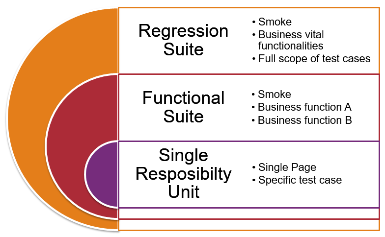
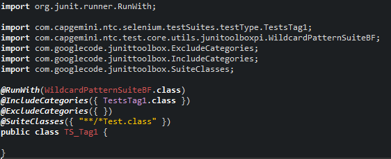
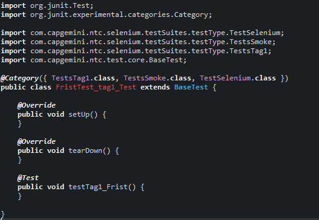
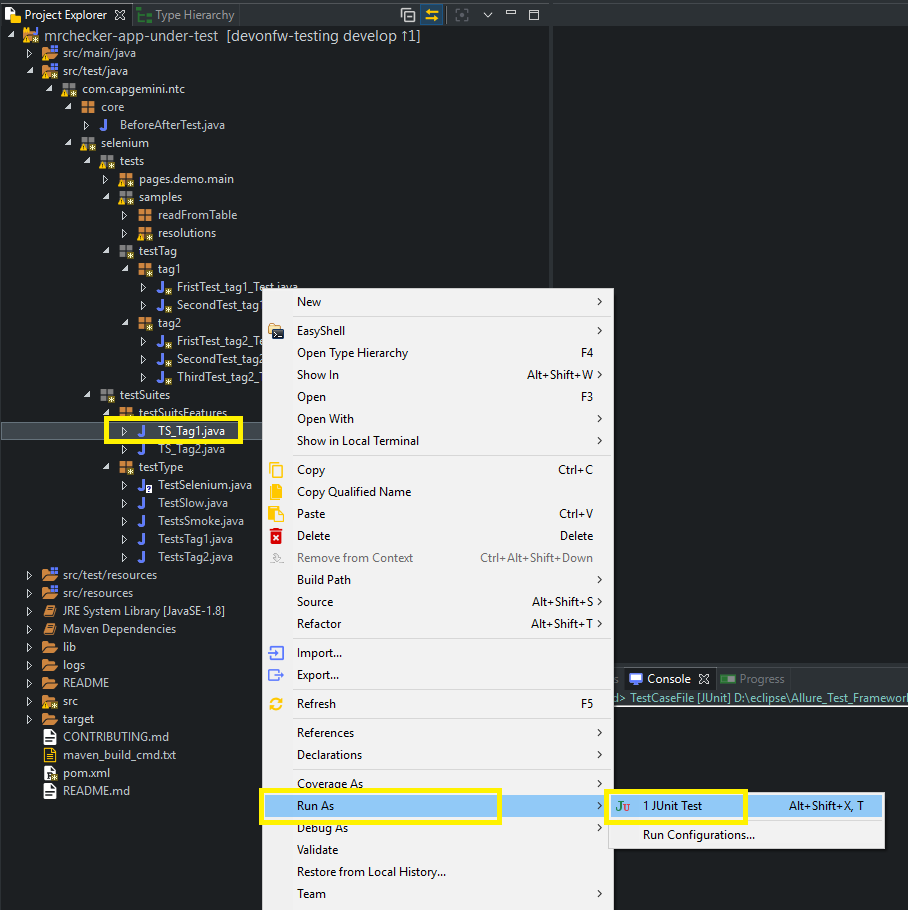

Content:
* [Why join Test Cases in groups - Test Suites](https://github.com/devonfw/devonfw-testing/wiki/Tags---categories-and-test-suites#why-join-test-cases-in-groups---test-suites)
* [How to build Test Suite based on tags](https://github.com/devonfw/devonfw-testing/wiki/Tags---categories-and-test-suites#how-to-build-test-suite-based-on-tags)
    * [Structure of Test Suite](https://github.com/devonfw/devonfw-testing/wiki/Tags---categories-and-test-suites#structure-of-test-suite)
    * [Structure of Test Case](https://github.com/devonfw/devonfw-testing/wiki/Tags---categories-and-test-suites#structure-of-test-case)
    * [Structure of Tags / Categories](https://github.com/devonfw/devonfw-testing/wiki/Tags---categories-and-test-suites#structure-of-tags--categories)
* [How to run Test Suite](https://github.com/devonfw/devonfw-testing/wiki/Tags---categories-and-test-suites#how-to-run-test-suite)

***

# Why join Test Cases in groups - Test Suites

## [Regression Suite](https://en.wikipedia.org/w/index.php?title=Regression_suite&redirect=no):

Regression testing is a type of [software testing](https://en.wikipedia.org/wiki/Software_testing) which verifies that software which was previously developed and tested still performs the same way after it was changed or interfaced with other software.

  * [Smoke](https://en.wikipedia.org/wiki/Smoke_testing_)
  * Business vital functionalities
  * Full scope of test cases

## [Functional Suite](https://www.rainforestqa.com/blog/2016-06-27-what-is-functional-testing): 

  * Smoke
  * Business function A
  * Business function B

## [Single Responsibility Unit](https://en.wikipedia.org/wiki/Single_responsibility_principle): 

  * Single page
  * Specific test case

***

# How to build Test Suite based on tags

## Structure of Test Suite

Where:
* *@RunWith(WildcardPatternSuiteBF.class)*  - search for test files under */src/test/java*

* *@IncludeCategories({ TestsTag1.class })* - search all test files with Tag *"TestsTag1.class"*

* *@ExcludeCategories({ })* - at last exclude test files. In this example, there is not exclusion

* *@SuiteClasses({ "\*\*/\*Test.class" })* - search only test files, where file name ends with *"<anyChar/s>Test.class"*

* *public class TS_Tag1*  - name of Test Suite "TS_Tag1"

Most commonly used filter to build Test Suite is usage of: 
* *@IncludeCategories({ })* 
* *@ExcludeCategories({ })* 

Example: 
1. *@IncludeCategories({ TestsTag1.class })* ,  *@ExcludeCategories({ })*   ->   will execute all test cases with tag *TestsTag1.class*

2. *@IncludeCategories({ TestsTag1.class })* ,  *@ExcludeCategories({ SlowTest.class })*   ->   will execute all test cases with tag *"TestsTag1.class"* although it will exclude, from this list, test cases with tag *"SlowTest.class"*

3. *@IncludeCategories({ })* ,  *@ExcludeCategories({ SlowTest.class })*   ->   will execute all test cases from */src/test/java*, although it will exclude, from this list, test cases with tag *"SlowTest.class"*

## Structure of Test Case

Where: 
* *@Category({ TestsTag1.class, TestsSmoke.class, TestSelenium.class })* - list of tags / categories signed to this test case - *"TestsTag1.class, TestsSmoke.class, TestSelenium.class"*

* *public class FristTest_tag1_Test* - name of test case *"FristTest_tag1_Test"*

## Structure of Tags / Categories

Tag name: *TestsTag1.class*

Tag name: *TestsSmoke.class*

Tag name: *TestSelenium.class*

# How to run Test Suite
To run Test Suite you will do the same steps as you do to run test case

*Command line*

> mvn test site -Dtest=TS_Tag1

*Eclipse*

