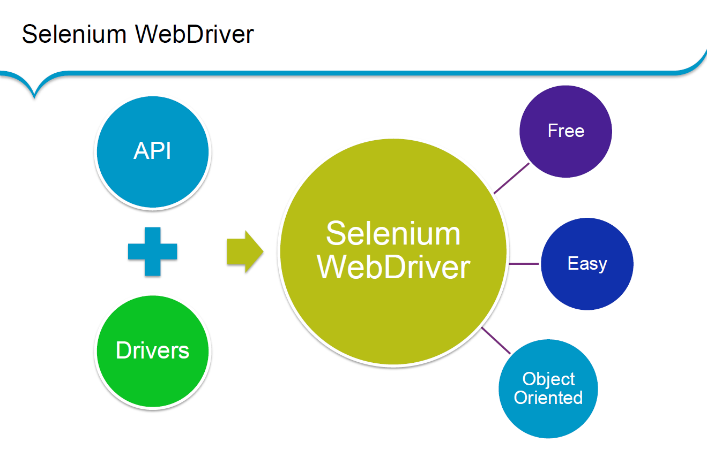
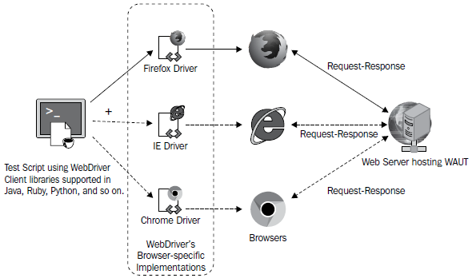

On the one hand, it is a very convenient API for the programmer that allows to interact with the browser, on the other hand it is a driver concept that enables this direct communication.

**How does this work?**

A tester, through his/her test script, can command WebDriver to
perform certain actions on the WAUT on a certain browser. The way the user
can command WebDriver to perform something is by using the client libraries
or language bindings provided by WebDriver. 

By using the language-binding client libraries, tester can invoke the
browser-specific implementations of WebDriver, such as Firefox Driver, IE
Driver, Opera Driver, and so on, to interact with the WAUT on the respective
browser. These browser-specific implementations of WebDriver will work
with the browser natively and execute commands from outside the browser
to simulate exactly how the application user does.

After execution, WebDriver will send out the test result back to the test script
for developer's analysis.